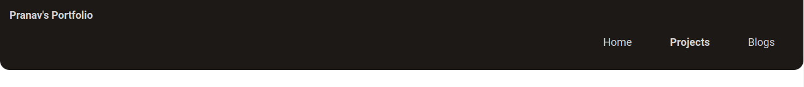
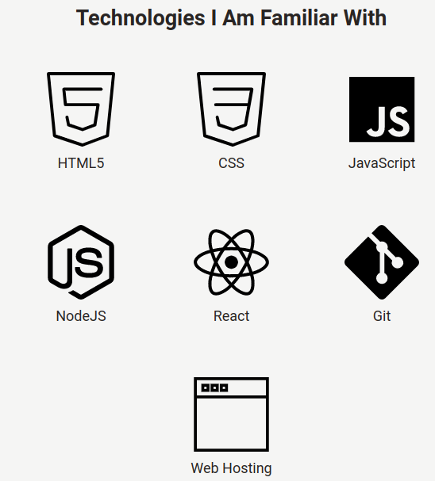
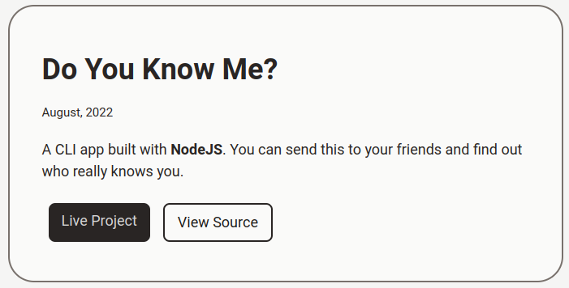
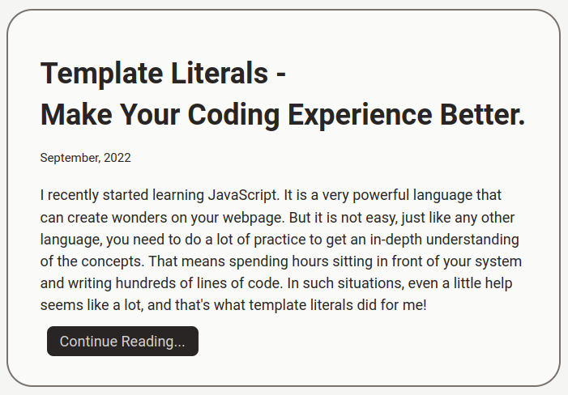

# MY PORTFOLIO Website

## Made Using HTML and CSS

### Hello there!
**Welcome to my personal portfolio website!** 
Here you can see all my projects that I have been and will make during my programming journey!

The website is very simple to navigate through. It has a **home page** that has some information about my skills. Then a **projects page** that conatins all of my projects and a **blogs page** where you can see the blogs I write.

The links for the projects page and the blogs page are also listed above the footer in the home page.

The **footer** includes links to some of my **social accounts** to help you **connect with me!**

***
### Navigation

The navigation bar contains the links to all the pages of my website. You simply need to click on the page you want to go to and it will take you there!

- **Navigation Bar**

***
### Technologies I Am Familiar With

This section is on the home page of the website. It showcase the logos of the technologies that I am familiar with. Upon clicking them, the user gets redirected to a website with detailed information about that technology.

- **Familiar technologies**

***
### Projects

The projects page has all the projects that I have made listed in the form of **cards**. Each card contains one project with its **live link** and link for its **source code**.

- **Projects page**

***
### Blogs

The blogs page also contians all of my blogs in the form of cards. Each card contains one blog with its preview and a link (**named Continue Reading...**) that redirects the user to the page where the blog is originally written. 

- **Blogs Page**

***
### Footer

The footer contains the links to my social accounts. You can simply click on the name of the social account you want to go to and it will redirect you to my account on that platform.

- **Footer**

***
#### Connect With Me And Be A Part Of My Journey!
